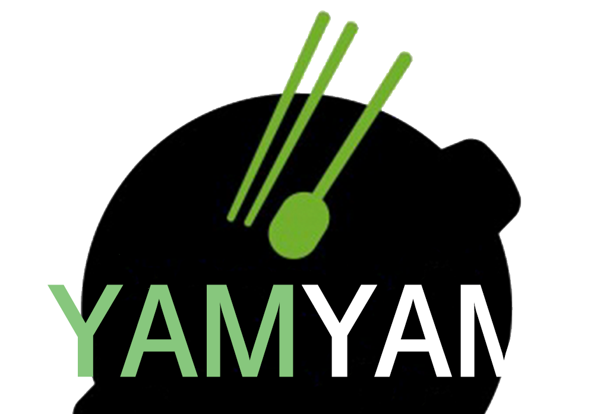

# 프로젝트 이름 : YAMYAM(식품 MES)

  

## 프로젝트 소개

● 프로젝트 개요/동기

  식품 소비 트렌드 변화에 발맞춰 식품 MES에 대한 필요성과 중요성이 증가하고 있고 실제로 도입도 되고 있다. 
이에 식품 MES를 기획하게 되었고, 세계로 뻗어가는 비비고를 보면서 만두를 제품으로 선정하게 되었다.

 

## 구현 및 적용 기술

  Spring Boot, HTML/CSS, Javascript, Thymeleaf, MyBatis, Spring Security, Java, Toast UI, Maven, docker, Jenkins, AWS, Oracle Cloud, GitHub, AJAX, Bootstrap, Lombok

 

## 구현 기능

### 공통 관리

  직원에 대한 관리를 할 수 있다. 
  공통적으로 필요한 공통코드와 상세공통코드를 관리할 수 있다. 
  필요한 자재들에 대한 정보와 관리를 할 수 있다. 
  판매, 설비, 자재별로 거래하는 업체에 대한 거래처 관리를 할 수 있다. 
  회사에서 판매하는 완제품에 대한 정보를 관리할 수 있다. 
  그리고 완제품에 대한 BOM을관리를 할 수 있다.

### 영업 관리

  주문을 등록하고 그에 따른 생산요청을 할 수 있다. 
  완제품에 대한 재고 및 안전 재고에 대해 관리할 수 있다. 
  주문을 바탕으로 완제품을 출고할 수 있고, 반품 또한 받을 수 있다.

### 생산 관리

  영업에서 등록한 생산 요청서 기반으로 생산 계획을 할 수 있고 생산부서 자체적으로 계획할 수도 있다. 
  발주가 완료된 생산계획건에 대해서 생산 지시를 등록할 수 있다. 
  생산지시에 따라 자재가 출고되면, 공정에 따라 생산을 시작할 수 있다. 긴급 중지와 재시작 또한 가능하다. 
  이렇게 생산된 제품은 입고가 되고 공정 실적에서 생산 이력을 확인할 수 있다. 
  제품 공정 흐름도에서는 라인별 공정과 설비를 조회,등록 할 수 있다.

### 자재 관리

  생산계획을 바탕으로 또는 자체적으로, 자재에 대한 발주를 관리하고 발주된 자재에 대해 입고 검수를 할 수 있다. 
  상태가 불량한 자재는 반품처리할 수 있으며, 입고된 자재를 생산 지시에 따라 출고하거나 유통기한을 보고 폐기출고 할 수도 있다.
  자재 입출고에 대한 조회, 자재 재고 관리, LOT별 재고 조회 또한 가능하다.

### 설비관리

  전체 설비 정보에 대해서 관리할 수 있다. 
  그리고 대기 중인 설비를 비가동 등록 할 수 있고 다시 해제할 수 있다. 또한 비가동 이력에 대한 관리도 가능하다. 
  설비 점검 이력을 관리할 수 있고, 점검 대상 설비에 대해서는 남은 점검일수를 기준으로 가져올 수 있다.

 

## 배운 점 & 아쉬운 점

 
